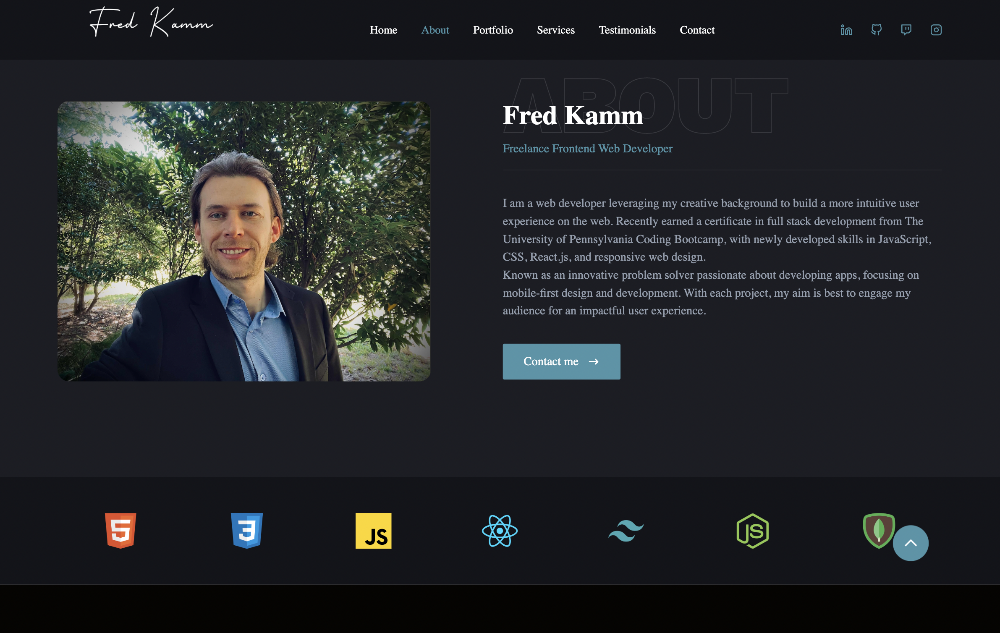

# React_Portfolio

This is my personal portfolio using react and tailwind. This portfolio is where i will be displaying my skills from previous projects to employers. This will be update frequently to show off some of my personal favorite projects.

# Inspiration

I wanted to create a professional portfolio that i can show to employers. I specifically wanted to create this using React.js so that i can showcase some of my react skills to people that visit my site.

Currently, I am updating the projects section of my portfolio that showcases some of my favorite passion projects. Eventually, i would like to upgrade this portfolio once i discover some new tricks to improve my react skills.

# Usage

    <a href="https://fredkamm.netlify.app/">
        Visit my site here!
    </a>

 

    

# Tools Used

- 
- 
-  -- used for the icons
-  -- used for the contact form

# Questions

    
Any questions or would like to collaborate Please shoot me an <a href="mailto:fred.kamm95@gmail.com"> Email </a>

    
If you would like to view more of my work  Visit my <a href="https://github.com/fredkamm ">Github</a> profile

